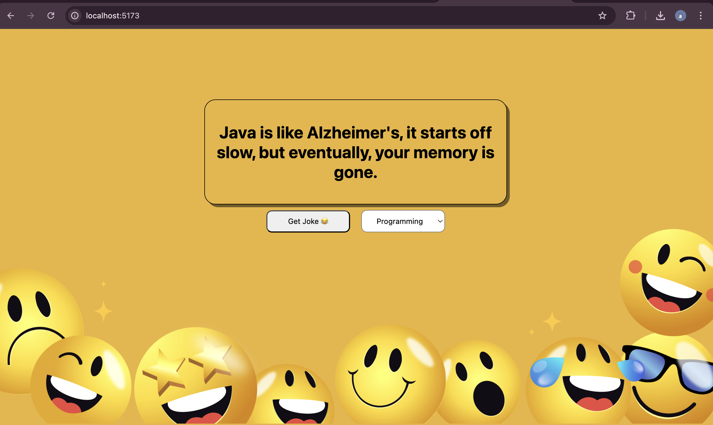

# React + Vite

# 😂 React Jokes App

A fun and interactive jokes app built with React that fetches random jokes from [JokeAPI](https://v2.jokeapi.dev/) based on user-selected categories. The app has a simple and clean UI with a cheerful wallpaper background and supports single and two-part jokes.

---

## 🎯 Features

- 🔄 Fetches random jokes using the JokeAPI
- 🎭 Supports different joke categories like Programming, Dark, Pun, Spooky, etc.
- 🧠 Handles both one-liner and two-part jokes
- 🎨 Stylish UI with custom fonts and a fixed wallpaper background
- 📱 Responsive layout (desktop-first)

---

## 🖼️ Preview

  

---

## 🚀 Getting Started

1. Clone the repository:

git clone https://github.com/your-username/react-jokes-app.git
cd react-jokes-app

2. Install dependencies:

npm install

3. Start the development server:

npm run dev

---

📡 API Used
JokeAPI

Fetches jokes based on category

Handles single and twopart jokes

---

🧩 Technologies Used

React.js (with functional components and hooks)

CSS (standard styles in App.css)

JokeAPI for jokes

Inline CSS for simple styling (like inline style attributes)
